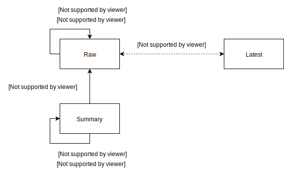

# NGSI-LDF

Suppose you want to know the median NOx value in your garden over the course of last week, would you find a service giving you the answer you're looking for? What if you're looking for the 33% quantile, or you want to know the moving median, what then? Chances are that if you do find a suitable service, it'll either be plagued by stability issues, rate limiting restrictions, unpleasant pricing schemes, or all of the above. 

Some queries simply require a lot of resources, and services have to spread these resources among all their users -- so something has to give. We propose to publish the data in the purest form possible, allowing data consumers to answer their own questions. The rationale being that slowly getting to an answer is better than not getting to an answer at all. Note that the two approaches aren't necessarily mutually exclusive; the ideal service combine both.

At the same time, we have noticed that many data owners aren't opposed to sharing their data as long as it doesn't interfere with their actual operations. It should not require a lot of resources - both in the computational and the development effort points of view. NGSI-LD APIs do not (currently) meet these requirements. 

This tool (conveniently named NGSI-LDF) tool republishes data from a given NGSI-LD API as Linked Data Fragments (LDF). Each individual fragment is a read-only and cacheable partial view of the data, alleviating a  the main concerns from data owners. Data consumers can find the data they're looking for by either filling in search templates (described using the hydra vocabulary) or by traversing other fragments (described using the tree ontology).

---

Note that the tool itself is still rough around the edges, and the NGSI-LD specification is still evolving. While we believe it already goes a long way towards efficiently disclosing NGSI-LD data, it may not work for all use cases (yet).

## Usage

This project is built using [Node.js](https://nodejs.org/en/) and [Express](http://expressjs.com/). Setting it up is as simple as cloning the repository and running `npm install` in the project root. The server can be started by running `npm start`. The default port is `3000` but this can be configured through an environment variable, for example: `PORT=8888 npm start`.

The root directory contains a configuration file (`config.toml`) that contains the other parameters. The default file contains comments detailing their purpose:

```toml
[ngsi]
  # Location of the NGSI-LD endpoint
  host = "http://localhost:3000"

[api]
  # Base URI of the generated fragments
  host = "http://localhost:3001"
  # number of observations to include in the /latest fragments
  lastN = 100

[data]
  # NGSI-LD exclusively uses relative property URIs
  # These are resolved using the active context
  # Relative URIs used as objects (in JSON-LD) are considered relative to the base URI instead
  # This is a list of such properties that need to be made absolute
  metrics = ["NO2", "O3", "PM10", "PM1", "PM25"]
```

## Fragmentations

The fragmentation strategy ultimately determines the usability of the published Linked Data Fragments. Making them too granular eliminates the cacheability of the data, making them too course makes the data harder to ingest for consumers. Keeping this in mind, we currently support three common geospatial bucketing strategies and a flexible temporal fragmentation strategy.

All published data is fragmented geospatially, but not at all data is fragmented temporally. We call geospatial fragments _tiles_, and tiles that are also temporally fragmented _tile pages_ or simply _pages_.

### Geospatial Fragmentations

Each geospatial fragmentation has a predefined 'acceptable' range of coarseness. 

#### Slippy Tiles

Made popular by digital maps such as Google Maps and the OpenStreetMap project, this fragmentation is essentially a geospatial quadtree. Fragments that use this fragmentation adhere to the following path template: `/{z}/{x}/{y}` where:

* `z` is the zoom level. Zoom level 0 covers the entire world, zoom level 1 contains 4 tiles, ... We support values that lie in the interval [13, 14].
* `x` is the tile longitude. Possible values lie in the interval [0, 2^n], where 0 corresponds to the westernmost tile and 2^n corresponds to the easternmost tile.
* `y`is the tile longitude. Possible values lie in the interval [0, 2^n], where 0 corresponds to the *northernmost* (**not** the southernmost) tile and 2^n corresponds to the southernmost tile. 

Example functions to translate a WGS84 coordinate to a tile coordinate as well as functions to translate tiles coordinates to their *top left* corners can be found on the [OpenStreetMap wiki](https://wiki.openstreetmap.org/wiki/Slippy_map_tilenames).

#### Geohash

Geohashes are commonly used to compactly store coordinates, but theyhttps://mail.google.com/mail/u/0/#inbox can also be used as a bucketing strategy. Essentially they are also based on quadtrees; element `0` covers the entire world and contains elements (ordered from top to bottom, left to right )`01` `11` `00` `10`. The resulting bit sequence is then encoded in base32 to obtain the actual geohash.  Fragments that use this fragmentation adhere to the following path template: `/geohash/{hash}` where:

* `hash` is the geohash. The length of this hash is also called the geohash precision. We support precision values that lie in the interval [5, 6].

See the [Wikipedia page](https://en.wikipedia.org/wiki/Geohash) for more information.

#### H3

The other two fragmentation strategies yield (more or less) rectangles. Researchers have found that hexagonal grids can be a better fit than rectangular grids (for example, [this](https://www.sciencedirect.com/science/article/pii/S0304380007001949) paper). H3 is such a hexagonal grid system developed by Uber. Fragments that use this fragmentation adhere to the following path template: `/h3/{index}` where:

* `index` is the grid cell identifier. Libraries (such as [h3-js](https://github.com/uber/h3-js)) can be used to determine the precision. We support precision that lie in the interval [6, 7].

See the [Uber blog](https://eng.uber.com/h3/) for more information.

### Temporal Fragmentations

Observations that happen in the same time period can be placed in the same bucket. The default bucket size is 1 hour, which means that an observation that happened at `2019-11-05T15:36:00.000Z` can be found in the `2019-11-05T15:00:00.000Z` bucket.

Temporal fragmentations are also used to aggregate data, in which case we can between the aggregation fragmentation (that is, computing the aggregation) and the one for the pagination (for the data publishing).  

## Interfaces

### Raw Data

The raw data interfaces adhere to any of these templates:

* **Slippy**: `/{z}/{x}/{y}{?page}`
* **Geohash**: `/geohash/{hash}{?page}`
* **H3**: `/h3/{index}{?page}`

Where `page` corresponds to a XSD DateTime string in UTC. If no page starts at the specified time, the page containing that time is returned instead. All other parameters are defined in the Geospatial Fragmentations section.

The `@graph` element of the returned data contains the temporal representation of all entities in the specified area, following the NGSI-LD representation for 'Query Temporal Evolution of Entities' operations, with the exception that individuals don't (necessarily) contain their own contexts. This knowledge graph can be fed into NGSI-lD compatible clients. 

General-purpose JSON-LD clients must be wary of the differences between JSON-LD and NGSI-LD though. For example, the `observedAt` property for example is a DateTime literal -- even though this is not formally defined as such in the NGSI-LD core context. 

### Latest

The latest data interfaces adhere to any of these templates:

- **Slippy**: `/{z}/{x}/{y}/latest`
- **Geohash**: `/geohash/{hash}/latest`
- **H3**: `/h3/{index}/latest`

This interface returns raw data as well, and as such shares most of its properties with the raw data one. The difference is that this interface returns tiles that contain a fixed amount of observations -- instead of temporally fragmented pages. This is interface is more useful for application that are interested in real-time  data, as they can just periodically poll for new data. The raw data interface on the other hand is mostly useful for application that are looking for historical data.

An additional subscription endpoint for real-time could also be useful, but is not implemented right now. It is not immediately clear with approach is the most scalable. And as always, both approaches aren't necessarily mutually exclusive. Fragments with recent data can be used to kickstart an application that will then subscribe for real-time data. 

#### Aggregates

The aggregate (also called summary) data interfaces adhere to any of these templates:

- **Slippy**: `/{z}/{x}/{y}/summary?{page,period}`
- **Geohash**: `/geohash/{hash}/summary?{page,period}`
- **H3**: `/h3/{index}/summary{?page,period}`

Where `page` has the same meaning as in the raw data interface. `period` is a URI that signify aggregation windows. The currently supported values are `https://w3id.org/cot/Hourly` and `https://w3id.org/cot/Daily`. All other parameters are defined in the Geospatial Fragmentations section.

This interface returns data using the [SSN](https://www.w3.org/TR/vocab-ssn/) ontology instead of valid NGSI-LD data. This is due to two reasons:

* The NGSI-LD specification at the moment does not mention aggregates. This will likely change at some point, since NGSI v2 TSDB did support this.
* NGSI-LD is very entity-focused, which makes some aggregations hard to express. The mean value of a metric in some region isn't a property of a single entity anymore. This assumes that fragment regions are not entities in the original NGSI-LD data, but this should be the case because the source data should be fragmentation agnostic. 

## Hypermedia Controls

#### Search Template

Each fragment defines its own URI structure so that clients that know which other fragments they're looking for can simply fill in the template and arrive at their destination. This kind of hypermedia control is defined using the [hydra](https://www.hydra-cg.com/spec/latest/core/) vocabulary. For example, this is a possible search template for the aggregate data:

```json
"hydra:search": {
  "@type": "hydra:IriTemplate",
  "hydra:template": "http://localhost:3001/geohash/{hash}/summary{?page,period}",
  "hydra:variableRepresentation": "hydra:BasicRepresentation",
  "hydra:mapping": [
    {
      "@type": "hydra:IriTemplateMapping",
      "hydra:variable": "hash",
      "hydra:property": "tiles:geohash",
      "hydra:required": true
    },
    {
      "@type": "hydra:IriTemplateMapping",
      "hydra:variable": "page",
      "hydra:property": "schema:startDate",
      "hydra:required": false
    },
    {
      "@type": "hydra:IriTemplateMapping",
      "hydra:variable": "period",
      "hydra:property": "cot:hasAggregationPeriod",
      "hydra:required": false
    }
  ]
}
```

The `hydra:template` property defines a URI template ([RFC 6570](https://tools.ietf.org/html/rfc6570)), and the `hydra:mapping` describes which values have which role on the template. The `hydra:property` property describes the relationship between the requested fragment and the filled in value. 

#### Traversal

Individual fragments are also linked together, so that data consumers can traverse them to get to their destination. The relationship between fragments is defined using the [tree](https://github.com/pietercolpaert/TreeOntology) vocabulary. Each fragment has a value in the tree: the time period it covers. The following image illustrates how the fragments are linked together:




In essence:

* Raw and summary data pages contain links to the next and previous pages (respectively using `tree:GreaterThanRelation` and `tree:LesserThanRelation` links).
* The active raw data page, that is the one that contains observations happening right now, is linked with the latest data fragment with `tree:AlternativeViewRelation` links.
* The summary data pages refer to the raw data pages that were used to compute the aggregate values with `tree:DerivedFromRelation` links.

## Data Examples

The following data fragments were generated using air quality data from imec's [Bel-Air](https://www.imeccityofthings.be/en/projecten/bel-air) project, accessed through the [Obelisk](https://obelisk.ilabt.imec.be) platform.

* Raw data:
  * [/14/8393/5467](examples/raw_1.jsonld)
  * [/14/8393/5467?page=2019-10-28T12:00:00.000Z](examples/raw_2.jsonld)
  * [/geohash/u155kx](examples/raw_3.jsonld)
  * [/h3/871fa4c5dffffff](examples/raw_4.jsonld)
* Latest data:
  * [/14/8393/5467/latest](examples/latest_1.jsonld)
* Summary data:
  * [/14/8393/5467/summary](examples/summary_1.jsonld)
  * [/14/8393/5467/summary?page=2019-10-28T00:00:00.000Z](examples/summary_2.jsonld)
  * [/14/8393/5467/summary?page=2019-10-24T00:00:00.000Z&period=https%3A%2F%2Fw3id.org%2Fcot%2FDaily](examples/summary_3.jsonld)

## Request Translations

Equivalence of fragmentations and NGSI-LD parameters

## Headers

CORS - NGSI-LD context

Cache

Compression